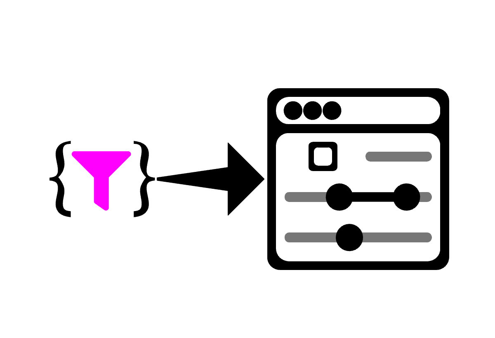
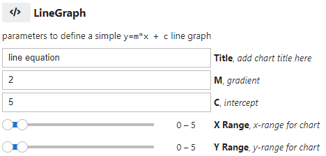

# ipyautoui

[](https://mybinder.org/v2/gh/maxfordham/ipyautoui/HEAD) [](https://github.com/psf/black) [](https://badge.fury.io/py/ipyautoui)



## Try in online

launch [](https://mybinder.org/v2/gh/maxfordham/ipyautoui/HEAD).

## Installation

```sh
pip install ipyautoui
mamba install ipyautoui -c conda-forge  # mamba ... TODO: add to conda-forge.
conda install ipyautoui -c conda-forge  # or conda ... TODO: add to conda-forge.
```

## Intro

A high-level wrapper library that sits on top of [**ipywidgets**](https://github.com/jupyter-widgets/ipywidgets) (and other ipy- widget libraries), [**pydantic**](https://github.com/samuelcolvin/pydantic/) and Jupyter rich display system to template and automate the creation of widget forms / user-interfaces. The core user-facing classes in this library are **AutoUi**, **AutoVjsf** and **AutoDisplay**:

```python
from ipyautoui import AutoUi, AutoVjsf, AutoDisplay, demo

demo()
```

ipyautoui aims to give you as much as possible out-the-box, whilst also supporting a simple workflow to extend and customise the interface to specific user requirements.

## Summary of main features

### AutoUi

```python
from pydantic import BaseModel, Field
from ipyautoui import AutoUi

class LineGraph(BaseModel):
    """parameters to define a simple `y=m*x + c` line graph"""
    title: str = Field(default='line equation', description='add chart title')
    m: float = Field(default=2, description='gradient')
    c: float = Field(default=5, ge=0, le=10, description='intercept')
    x_range: tuple[int, int] = Field(
        default=(0,5), ge=0, le=50, description='x-range for chart')
    y_range: tuple[int, int] = Field(
        default=(0,5), ge=0, le=50, description='y-range for chart')

ui = AutoUi(schema=LineGraph)
ui
```



```python
ui.value  # there is a `value` trait that is always kept in-sync with the widget input form
# {'title': 'line equation',
#  'm': 2,
#  'c': 5,
#  'x_range': (0, 5),
#  'y_range': (0, 5)}

#  methods / stored values
ui.file(path) #  file data to .json file
ui.value #  input form value dict
ui.model #  pydantic model (if given as input, AutoUi can be called from a jsonschema only also)
ui.schema #  jsonschema
AutoUi.create_autoui_renderer #  creates a json-serializable pointer
AutoUi.parse_file #  init ui with data from .json file
```

* AutoUi uses [**pydantic**](https://github.com/samuelcolvin/pydantic/) to define the schema of User Input form, and then infers the widget to use based on type and user-directives
* `ipyautoui.custom.` provides useful widgets (e.g. iterable) that aren't included within the core ipywidgets library
* ipyautoui defines a best practice for creating and integrating custom widgets, and as default includes some widgets from other popular widget libraries (e.g. ipydatagrid, ipyfilechooser).
* ipyautoui handles observing the values, and maintains a stateful and validated `.value` parameter for the whole user input form.
* AutoUi also allows the user to specify the usage of [**ipyvuetify**](https://github.com/widgetti/ipyvuetify) and

  * **note**. this is the recommended approach for simple and generic input forms. Where custom UI objects are required these can be built using the ipyautoui core library.

### AutoVjsf

`AutoVjsf` works in exactly the same way as `AutoUi` , but instead of using `ipywidgets` to render the JSON schema it uses [ipyvuetify](https://github.com/widgetti/ipyvuetify) and [vuetify-jsonschema-form](https://github.com/koumoul-dev/vuetify-jsonschema-form).

### Should I use AutoUi or AutoVjsf?

#### AutoVjsf

The excellent documentation for [**vuetify-jsonschema-form**](https://koumoul-dev.github.io/vuetify-jsonschema-form/latest/) can be used to create your schema. Anything possible in vjsf is therefore possible using AutoVjsf (TODO: implement markdown editor). This has a much more complete coverage of the json-schema specification, as well as the added benefit of out-the-box support of mobile applications. It falls down if you want to specify custom renderer objects.

```{note}
when you're using pydantic to make the schema, "-" cannot be used field names, 
but vuetify-jsonschema-form requires them (e.g. "x-display"); 
use "x_display" instead and AutoVjsf does the conversion).

```

#### AutoUi

The main benefit of AutoUi (and main the reason for continuing to develop it), is that it makes it simple to create custom renderers for specific parts of the json-schema, facilitating the bespoke the requirements of a custom project. See [custom-renderers](custom-renderers.ipynb).

### AutoDisplay

* AutoDisplay uses Jupyter's rich display system and large ecosystem of 3rd party packages to create a simple and unified display wrapper to various filetypes.
* The renderer for a given file is inferred from the file extension.
  * TODO: where the datasource is not a file, the extension is a mapping code that maps a renderer to the datastructure of the data.
* Custom renderer's can be passed to `AutoDisplay` allowing it to display user-defined filetypes (or compound extension filetypes)

## How it works

* Make a pydantic model (or json schema) that defines the UI
* Pass the model to `AutoUi` or `AutoVjsf` to generate an user-interface
* Save the UI fields to file
* Assign a compound-json filetype to the schema and generate `AutoDisplay` rendererer
* Use `AutoDisplay` to display the json file using the AutoUi interface

## Dependencies

This package intends to be high-level, and unifies many other ipy- libraries under a simple and familiar API.

* [pydantic](https://github.com/samuelcolvin/pydantic/)
* [ipywidgets](https://github.com/jupyter-widgets/ipywidgets)
* [ipydatagrid](https://github.com/bloomberg/ipydatagrid)
* [ipyfilechooser](https://github.com/crahan/ipyfilechooser)
* [ipyvuetify](https://github.com/widgetti/ipyvuetify)
* [vuetify-jsonschema-form](https://github.com/koumoul-dev/vuetify-jsonschema-form)
* [Plotly](https://github.com/plotly/plotly.py) (for viewing `.plotly.json` files. note. this needs to be added by the user)

It is also obviously wholly dependent on the excellent json-schema specification:

* [json-schema](https://json-schema.org/)

## Development installation

```sh
$ git clone https://github.com/maxfordham/ipyautoui
$ cd ipyautoui

# assuming that you have `mamba` installed:
$ mamba env create -f environment-dev.yml

# run tests
$ pytest
```

## Packaging (restricted to core-maintainers)

```sh
hatch build  # builds to local folder
hatch publish  # publishes to pypi
```

## Contributions

AutoVjsf is a very thin wrapper where ipyvuetify and vuetify-jsonschema-form are doing all the work.
Many thanks to @mariobuikhuizen for providing me with the [boiler-plate code](https://github.com/widgetti/ipyvuetify/issues/182).
