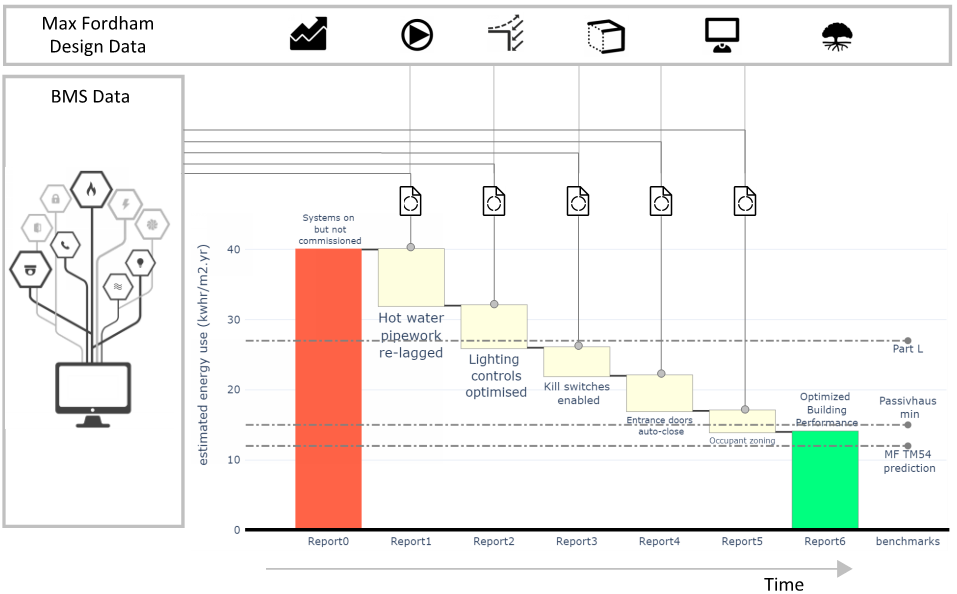

# Markdown Example

**Markdown** is a plain text format for writing _structured documents_, based on formatting conventions from email and usenet.

See details here: [**commonmark**](https://commonmark.org/help/)

\newpage

\toc

\newpage

## Images

**Note**. the images below are relative to the markdown file. When rendering the markdown file pandoc uses [extension-rebase_relative_paths](https://pandoc.org/MANUAL.html#extension-rebase_relative_paths)
to update the image paths so they are relative to the jupyter notebook. This is required to correctly render the images.

## lists

- **bold**
- _italic_
- `inline code`
- [links](https://www.markdownguide.org/basic-syntax/)
  - sub-item

## numbers

1. item 1
1. item 1
1. item 1
   1. sub item
  
## Tables

## Pipe tables

|   | Notes                                                                                                                                                                                                |
|--:|:-----------------------------------------------------------------------------------------------------------------------------------------------------------------------------------------------------|
| 0 | To be read in conjunction with all other contract documentation,                                                                                                                                     |
| 1 | References to manufacturers and/or devices thereof are to indicate a general level of functionality and quality. Alternative manufacturers will be considered where equivalence can be demonstrated. |
| 2 | Contractor to ensure that the catalogue number is consistent with the description prior to order.                                                                                                    |
| 3 | Contractor to ensure that quantities of equipment are consistent with Architects layout.                                                                                                             |

## Grid tables

Grid tables make it easier to specify complex formatting within cells...

+---------------+---------------+--------------------+
| Fruit         | Price         | Advantages         |
+===============+===============+====================+
| Bananas       | $1.34         | - built-in wrapper |
|               |               | - bright color     |
+---------------+---------------+--------------------+
| Oranges       | $2.10         | - cures scurvy     |
|               |               | - tasty            |
+---------------+---------------+--------------------+
